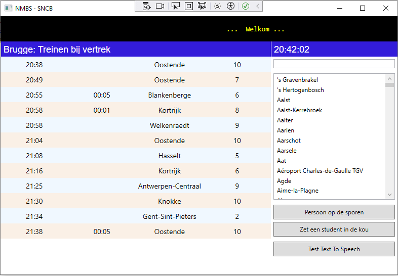
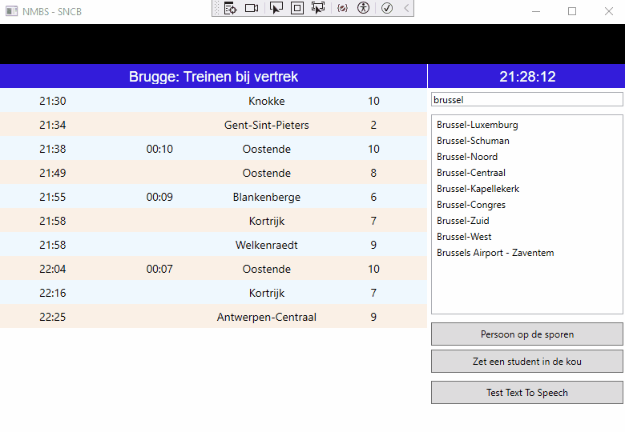
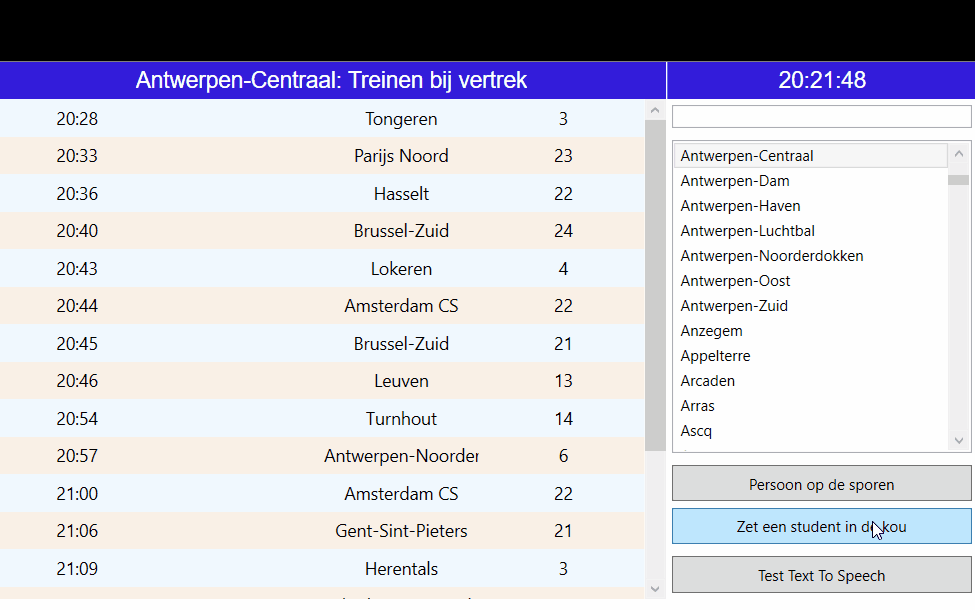
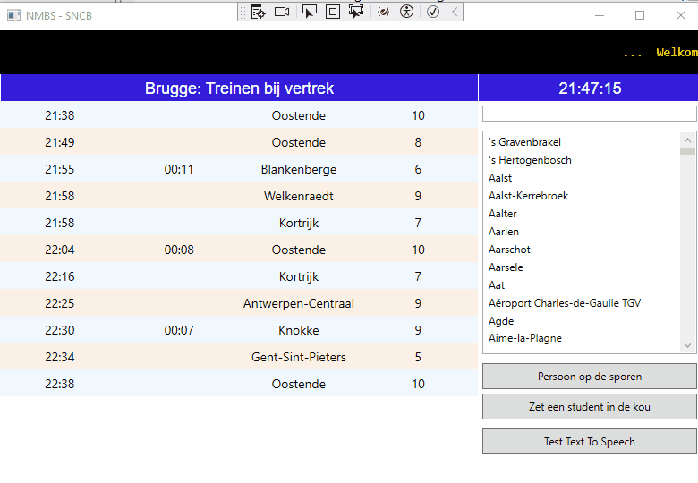

# PRE - PE Station observation

## Algemeen

We maken een applicatie die de live situatie in een Belgisch station weergeeft en vertragingen en vertrekuren registreert.

Benodigde kennis:
- LINQ
- Delegates
- Events
- Extension methods
- Streams
  - FileStreams
  - Webrequests
  - (TextToSpeech Stream) = uitbreiding
- Async/Await

## ⚠️ Het gebruik van AI Tools wordt niet toegestaan!

Er mag geen enkele AI tool (chatGPT, GitHub Copilot, ...) gebruikt worden voor deze PE. Het ongeoorloofd gebruik van AI leidt automatisch tot het opstarten van een fraudedossier volgens het onderwijs en examenreglement, wat kan leiden tot een nulscore op 1 of meer opleidingsonderdelen.
Bij twijfel kan een student geroepen worden om de code toe te lichten.

## De basis

> **Bijkomende technische vereisten**: 
> 
>Voeg enkel event handlers toe in de codebehind. Er mogen geen events worden gelinkt in xaml of via de Visual Studio UI.
>

### De Stationsklok

Als opwarming beginnen we met een stationsklok te maken. Daarvoor maak je een klasse `Clock` aan in het core project. 

Bepaal zelf een goede structuur voor het core project, zodat dit overzichtelijk blijft. 

We zullen in deze `Clock`-klasse handmatig een timer aanmaken. Maak dus zeker **geen** gebruik van bestaande Timer-klasses!

Je voorziet volgende zaken:

- een constructor die 1 parameter delay van het type `int` ontvangt.
- een event `ClockTick`, dat getriggerd wordt telkens als een bepaalde delay voorbij is. Je kan gebruik maken van de standaard delegate voor een event.
- een methode `StartClock` die ervoor zal zorgen dat het event wordt getriggerd in een lus.
- een methode `StopClock` die ervoor zal zorgen dat het event niet meer wordt getriggerd.

In je codebehind roep je de methode `StartClock`aan. Je zorgt ervoor dat wanneer het `ClockTick`-event plaatsvindt, de huidige systeemtijd wordt getoond in het Label `lblTime`. Let erop dat de code die na het aanroepen van `StartClock` wordt uitgevoerd niet moet wachten tot de lus voltooid is!

De klok tot een goed einde gebracht? Waauw, goed bezig! Op naar de services.

### De Services
Goede code en services zijn zoals Infrabel en de NMBS: ze doen elk apart enkel wat ze goed kunnen en communiceren onrechtstreeks met elkaar. 

We zullen daarom ook 2 services aanmaken: 
- `InfrabelService`: verantwoordelijk voor het **ophalen van de data** i.v.m. stations en  vertrekinformatie
- `NmbsService`: verantwoordelijk voor de **communicatie** van vertrekken en vertragingen naar de reizigers via de displays en omroepen, maar ook het rapporteren van de gegevens

#### InfrabelService

We werken voor de vertrekinformatie in deze opdracht met een API.

De documentatie vind je voor
- de vertrekinformatie: [hier](https://docs.irail.be/#liveboard-liveboard-api-get)
- voor de stations is dit [hier](https://docs.irail.be/#stations).

De informatie halen we op via de volgende url's: 

- de stations: `https://api.irail.be/stations/?format=json&lang=nl` 
- voor vertrekinformatie: `$"https://api.irail.be/liveboard/?station={station}&arrdep=departure&lang=nl&format=json&alerts=true`.

Maak de nodige api-model classes aan om de objecten van json om te zetten naar class objecten. Sla ze op in een passende folder van het `Core`-project. Gebruik eventueel tools zoals https://json2csharp.com/

Let op volgende zaken:
- In de UI worden de vertrekken gesorteerd op tijdstip van vertrek (zonder vertraging) en daarna op bestemmingsstation. Zorg hier voor de nodige **LINQ-queries**. 
- De vertrekinformatie kan worden getoond door deze lijst te koppelen aan de `ItemsSource` van de datagrid *dgrTrains*. Zorg met `LINQ` voor een juiste mapping, zodat enkel de benodigde properties in de kolommen zichtbaar zijn.
- Toon de stations toont in de ListBox in alfabetische volgorde.
- Het eerste station dat geladen wordt is dat van **Brugge**.
- Als je verandert van station wordt er een nieuw `liveboard` binnengehaald. Zorg in de UI voor een mooie loading indicator.

Naast het ophalen van data kan de `InfrabelService` ook volgende zaken afhandelen:
- **Persoon op de rails**: Als treinreiziger wil je dit niet meemaken, maar een persoon die zich op het spoor bevindt, zorgt voor een `random` vertraging. 
- **Ambeteer de student**: Niets vervelender dan een trein die voor tijd vertrekt. Studenten bevestigen dit: het is schering en inslag. Daarom, als deze methode wordt aangeroepen, laat je de eerstvolgende trein vertrekken (zonder pardon, wel met de nodige aankondiging en logging).

>
>Om de update van het liveboard door te geven aan de ui, **moet** je gebruiken maken van een **event**. Zorg hier voor een passende *delegate* met *custom EventArgs*!
>

#### NmbsService
Elke update van het `liveboard` stelt deze service in staat om:
- **vertragingen** op te sporen en te melden
- **vertrokken treinen** te melden. 

De meldingen gebeuren minimaal op volgende manieren:
- wegschrijven naar een **logbestand**. 
- weergave op het info/waarschuwings-paneel *lblInfo* (zwart met gele letters).

### Extension methods (class **DateTimeHelpers**)

De tijden van vertrek en vertraging in de API worden uitgedrukt
- in seconden sedert 1 januari 1970
- in Greenwich Main Time (ook UTC genoemd)

Daarom is het handig om enkele methoden te hebben om waarden om te zetten.

#### GetTime

- **Extension method** van long.
- Ontvangt een aantal seconden. Deze stellen de verstreken seconden sedert middernacht voor.
- Retourneert een string waarde met de uren en minuten van de berekende tijd.  
    Vb. "22:33"

#### GetUTCGap

Berekent het verschil tussen de UTC en de systeemtijd in seconden.

Je mag hier het getal 3 600 retourneren als je niet direct een oplossing ziet.

#### Readonly Properties

Voorzie in de klasse met de vertrekinfo (zie onder de map Models) **read-only properties** (zie PRA!) die

- het uur van vertrek 
- de eventuele vertraging 

in een leesbaar formaat weergeven (zie GetTime ).

### Andere Tips

Neem de documentatie nog eens door over ` override bool Equals (object obj) ...`. Dit werd behandeld in het onderdeel over Composition in het hoofdstuk over Dapper. Het zou wel eens nodig kunnen zijn voor deze opdracht.

## Functionaliteit

### De klok

In **lblTime** wordt de tijd getoond.

### De stations

Bij het opstarten worden de stations opgehaald uit de API. De stations worden in *lstStations* getoond.

Het eerste station dat getoond wordt is dat van **Brugge**.

### De vertrekinfo

Wanneer het geselecteerde station verandert, worden de Liveboard gegevens van dat station opgehaald.

In de GUI worden de volgende zaken getoond:
- Het station van vertrek in *lblTitle*
- Daaronder volgt vertrekinformatie per reis:
    - voorzien vertrekuur
    - aangekondigde vertraging
    - bestemming
    - spoor

### Melding van een trein die vertrekt

Als het uur van het voorzien vertrek bereikt is (zie event **InfrabelService**), volgt een boodschap in *lblInfo*.

Voorbeeld:

>
> 
>
Om dit te simuleren, kun je op de knop *Zet een student in de kou* klikken. Dan de trein die normaal gezien het eerst zou vertrekken uit het `liveboard`.

### Melding van een vertraging

Wanneer een vertraging gemeld wordt (zie event **InfrabelService**), volgt een boodschap in *lblInfo*.

Voorbeeld:

>
> 
>

Om dit te simuleren, kun je op de knop *Persoon op de sporen* klikken. Dan wordt er een vertraging van maximum 60 minuten ingesteld bij een willekeurig gekozen trein. Vernieuw de vertrekinformatie in de GUI zonder dat je de gegevens opnieuw ophaalt via de API.

> ⚠
>
> Bij een vertrek of vertraging werk je met de gegevens die je van de API hebt gedownload. Het is niet de bedoeling om de gegevens daarna opnieuw in te lezen. Bij een vertrek verwijder je de vertrokken trein uit de collection.
>
> Als er meerdere meldingen na elkaar komen, kun je ze niet allemaal lezen. Daarmee hoef je geen rekening te houden. De laatste melding blijft dus staan, tot er zich iets nieuws voordoet.

### Station van vertrek wijzigen

Door de selectie in lstStations te wijzigen, worden de gegevens van een ander **station** opgehaald.

Daarna worden de **vertrekgegevens** van het geselecteerde station opgehaald via de API en getoond in de GUI.

Zorg dat het duidelijk is dat er een nieuw station geladen wordt: 
- Pas de tekst in *lblInfo** aan naar: ... loading ...
- Maak het datagrid volledig leeg.

### Logging in een text file

Elk vertrek of vertraging van een trein wordt gelogd.

- Elk vertrek van een trein wordt gelogd. De tekst ziet er bvb. als volgt uit:

    > 18:23
    >
    > De trein Aarschot naar Tongeren van 18:23 is vertrokken

- Elke vertraging wordt gelogd. De tekst ziet er bvb. als volgt uit:

    > 18:23
    >
    > Alken: De trein naar Blankenberge
    > heeft een vermoedelijke vertraging van ongeveer 3 minuten   

## Uitbreiding

Als je de basisoefening maakt, kan je voldoende tot goed scoren op je PE. Ben je ambitieuzer, kijk eens naar onderstaande uitbreidingen: deze kunnen je score pimpen en laten zien wat je in je mars hebt. Bekijk gerust de rubriek om na te gaan wat de compensatie hiervoor is. 

**Let op!** Indien de basisoefening niet functioneel is, kunnen er geen extra punten verdiend worden. Hou hier rekening mee!

### 1) Filter de stations (💪 )
Er zijn enorm veel stations die gedownload worden door de API. Boven de listbox met stations vind je een `TextBox` terug. Zorg ervoor dat, als je tekst invoert of aanpast, de listbox de juiste filters toepast. 

### 2) Automatische updates (💪💪)
Herbruik de `Clock` om het `liveboard` om de 30 seconden te  updaten. **Let op!** de loading mag deze keer niet zichtbaar worden. Het zijn immers stille updates.

### 3) Detecteer treinvertragingen (💪💪💪💪)
Er zijn veel verschillende manieren om door te geven aan de `NmbsService` dat er een treinvertraging voorkomt. Maar wat als de NmbsService dat zelf moet ontdekken aan de hand van de verschillen tusen de opeenvolgende `liveboards` ? LINQ to the rescue !

### 4) Detecteer treinvertrekken (💪💪💪💪)
Gelijkaardig aan het voorgaande: Maar detecteer wanneer een trein vertrokken is !

=> 3 en 4 samen zijn goed voor (💪💪💪💪💪)

### 5) Text to speech (💪💪 of 💪💪💪)
In c# op windows kan je (Engelse) tekst laten voorlezen. Duik in de documentatie zodat, als je op de knop `Test text to speech` drukt, er een willekeurige (Engelse) tekst wordt voorgelezen (💪💪). 

Slaag je er in om de `NmbsService` bij een vertrek of een vertraging ook de informatie in het Engels te laten horen, dan krijg je hiervoor 💪💪💪. 

Succes!
